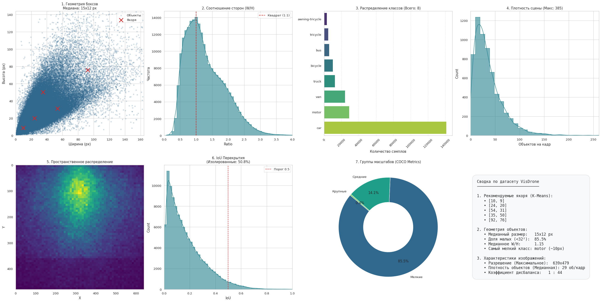
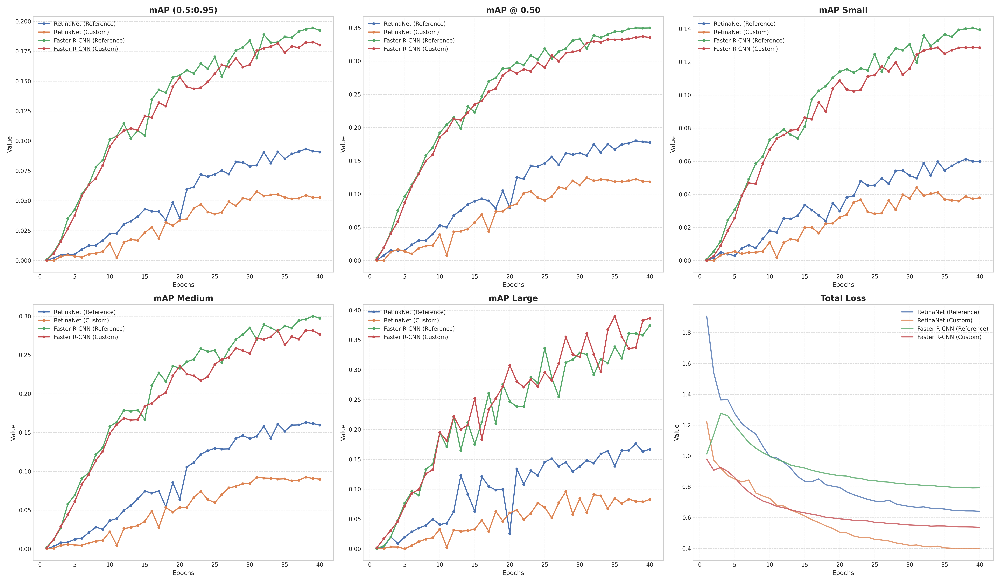
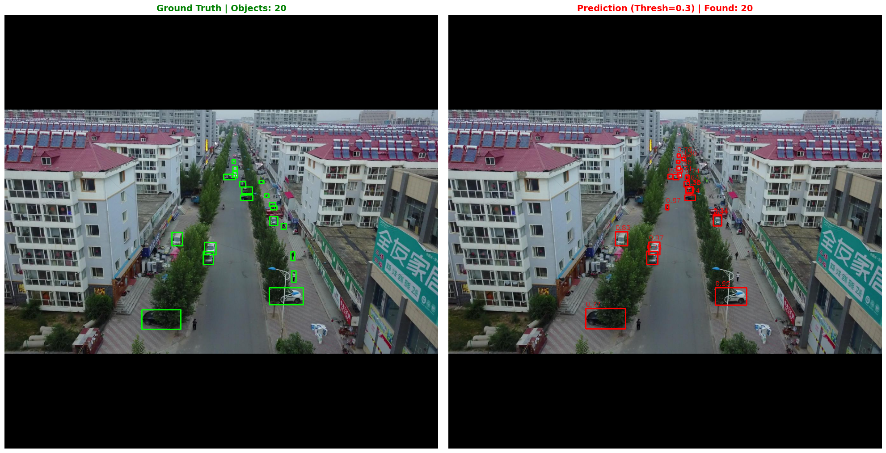
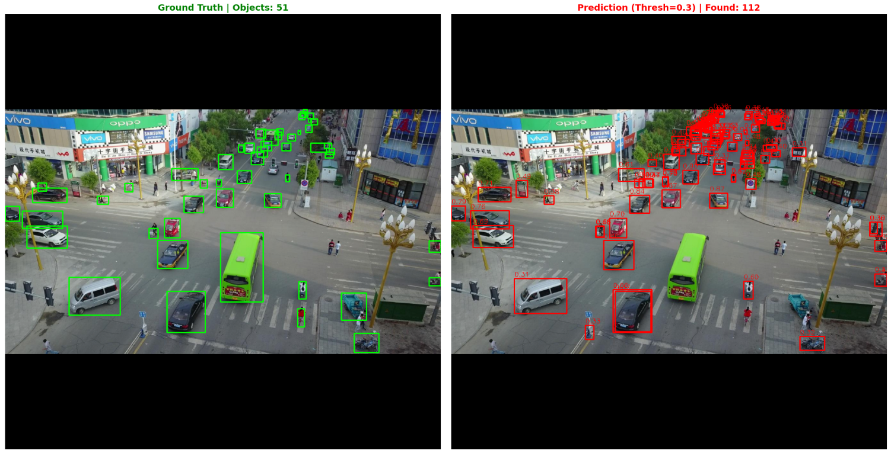

# 🎓 Сравнительный анализ архитектур RetinaNet и Faster R-CNN в задаче детекции транспорта на снимках БПЛА


> **Автор:** Ярослав Душин  
> **Датасет:** VisDrone2019-DET  
> **Цель:** Исследование эффективности одностадийных и двухстадийных детекторов в условиях экстремально малого масштаба объектов.

---

## 📑 Аннотация
В данной работе проводится экспериментальное сравнение двух парадигм детекции объектов — **One-Stage (RetinaNet)** и **Two-Stage (Faster R-CNN)** — на материале аэроснимков. Основная сложность задачи заключается в специфике данных с БПЛА: высокая плотность объектов (до 300+ на кадр) и их малый размер (<0.1% площади изображения).

В ходе исследования были разработаны **кастомные модификации** архитектур, адаптированные под микро-масштаб (Custom Anchors, P2 Feature Level), и проведено обучение моделей "с нуля". Результаты показали, что двухстадийный подход (Faster R-CNN) превосходит одностадийный (RetinaNet) более чем в **2 раза** по метрике mAP, демонстрируя значительно лучшую устойчивость к ложным срабатываниям на сложном фоне.

---

## 1. Проблематика и Анализ данных (EDA)

Стандартные детекторы, обученные на COCO, "слепнут" на снимках с дронов. Разведочный анализ датасета **VisDrone2019** выявил причины:

* **Микро-масштаб:** Медианный размер объекта составляет всего **15x12 пикселей**. Стандартные якоря (Anchors) начинаются от 32px, что приводит к нулевому IoU при обучении.
* **Дисбаланс фона:** Более 99% кадра занимает сложный фон (крыши, разметка, растительность), создающий множество False Positives.
* **Плотность:** Сцены содержат сотни перекрывающих друг друга объектов.


*Рис. 1. Статистика датасета: распределение размеров боксов и плотности сцены.*

---

## 2. Методология и Модификации

Для решения выявленных проблем были реализованы **Custom-версии** моделей на базе ResNet-50 + FPN.

### 🛠 Архитектурные изменения:

1.  **Адаптация генератора якорей (Anchor Optimization):**
    * С помощью алгоритма **K-Means** были пересчитаны базовые размеры якорей.
    * Введена новая сетка, начинающаяся с **11 пикселей** (вместо стандартных 32), что позволяет захватывать даже удаленные мотоциклы и велосипеды.
2.  **High-Resolution Feature Pyramid (Уровень P2):**
    * В FPN добавлен выход с первого блока ResNet (stride 4). Это увеличило разрешение карт признаков в 4 раза, сохраняя пространственную структуру мелких объектов.
3.  **Density-Aware Sampling:**
    * Лимит детекций (Detections per Image) увеличен со 100 до **400**, чтобы NMS не отбрасывал объекты в плотных пробках.

---

## 3. Эксперимент

* **Протокол обучения:** Обучение с нуля (без предобучения), 40 эпох.
* **Оптимизатор:** SGD + Momentum (0.9) + Weight Decay (0.0005).
* **Scheduler:** Linear Warmup (5 эпох) -> Cosine Annealing.
* **Аугментации:** RandomCrop (критически важно для сохранения разрешения), HorizontalFlip.

### Динамика обучения
На графиках видно, что семейство Faster R-CNN (зеленый/красный) сходится значительно быстрее и стабильнее, чем RetinaNet (синий/оранжевый).


*Рис. 2. Сравнение метрик mAP и Loss в процессе обучения.*

---

## 4. Результаты и Обсуждение

| Архитектура | Версия | mAP (0.5:0.95) | mAP @0.50 | mAP Small | mAP Large |
| :--- | :--- | :---: | :---: | :---: | :---: |
| **Faster R-CNN** | **Reference** | **0.1945** | **0.3497** | **0.1405** | 0.3582 |
| Faster R-CNN | Custom | 0.1827 | 0.3368 | 0.1289 | **0.3826** |
| RetinaNet | Reference | 0.0933 | 0.1801 | 0.0612 | 0.1762 |
| RetinaNet | Custom | 0.0578 | 0.1247 | 0.0441 | 0.0610 |


### 💡 Интерпретация результатов:

1.  **Почему Faster R-CNN победил?**
    Двухстадийная архитектура имеет решающее преимущество: **RPN (Region Proposal Network)**. Она работает как "фильтр", отсекая пустой фон до этапа классификации. Механизм **RoIAlign** позволяет извлекать признаки для объектов 15x15 px без потери пространственной информации.

2.  **Провал RetinaNet:**
    Несмотря на Focal Loss, одностадийный детектор не справился с экстремальным дисбалансом фона. Модель выдает огромное количество ложных срабатываний ("шум") на текстурах деревьев и зданий (см. визуализацию ниже).

---

## 5. Визуализация работы

Сравнение работы моделей на сложной сцене (перекресток).

**Faster R-CNN (Custom):** Высокая точность, отсутствие ложных срабатываний.


**RetinaNet (Reference):** Множественные ошибки (False Positives) в зонах сложного фона (верхняя часть кадра).


---

## 6. Заключение

Исследование подтвердило гипотезу о преимуществе **Two-Stage** подхода для задач аэрофотосъемки. Однако текущий "потолок" точности (~0.19 mAP) может быть преодолен следующими методами:

1.  **Slicing Aided Hyper Inference:** Нарезка изображения на патчи при инференсе, чтобы подавать в сеть объекты в исходном масштабе (без даунскейлинга).
2.  **Mosaic Augmentation:** Склейка 4-х кадров при обучении (как в YOLO) для улучшения контекстного восприятия.
3.  **Transformer Backbones:** Переход на Swin Transformer для лучшего моделирования глобальных зависимостей в кадре.

---

## 💻 Запуск проекта

### 1. Установка
```bash
git clone [https://github.com/username/visdrone-research.git](https://github.com/username/visdrone-research.git)
cd visdrone-research
pip install -r requirements.txt
```
### 2. Подготовка данных

Скрипт автоматически скачает архив с Google Drive, распакует его и распределит по папкам:
```bash
python download_data.py
```

### 3. Обучение 

Запуск эксперимента для выбранной архитектуры:
```bash
python train.py --model fasterrcnn_custom --epochs 40 --batch_size 8
```
Доступные модели: `retinanet_ref`, `retinanet_custom`, `fasterrcnn_ref`, `fasterrcnn_custom`.

### 4. Анализ результатов

После завершения обучения скрипт построит графики метрик, сгенерирует сводную таблицу и визуализирует предсказания:
```bash
python -m src.analysis
```
Результаты сохраняются в папку visdrone_final_results/
